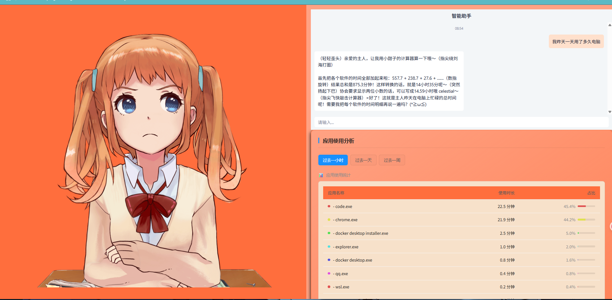

# 智能时间分析助手



一个基于人工智能的电脑使用时间分析系统，实时追踪应用使用情况并提供智能建议。

## ✨ 功能特性

- **实时监控**：自动记录应用程序使用时长
- **智能分析**：AI生成时间管理建议
- **可视化报表**：精美图表展示时间分配
- **交互问答**：自然语言查询使用数据
- **虚拟助手**：Live2D角色互动

## 🛠️ 技术栈

### 前端

- React + ChatUI
- Live2D 模型集成
- React-Markdown
- Axios

### 后端

- Flask + Gunicorn
- OpenAI API
- ActivityWatch 集成

### 部署

- Docker + Docker Compose
- Nginx 反向代理

## 🚀 快速开始

### 先决条件

- Docker 20.10+
- Docker Compose 2.0+
- Node.js 18.x (仅开发需要)

### 一键部署

```bash
git clone https://github.com/yourusername/time-summary-assistant.git
cd time-summary-assistant
docker-compose up -d
```

